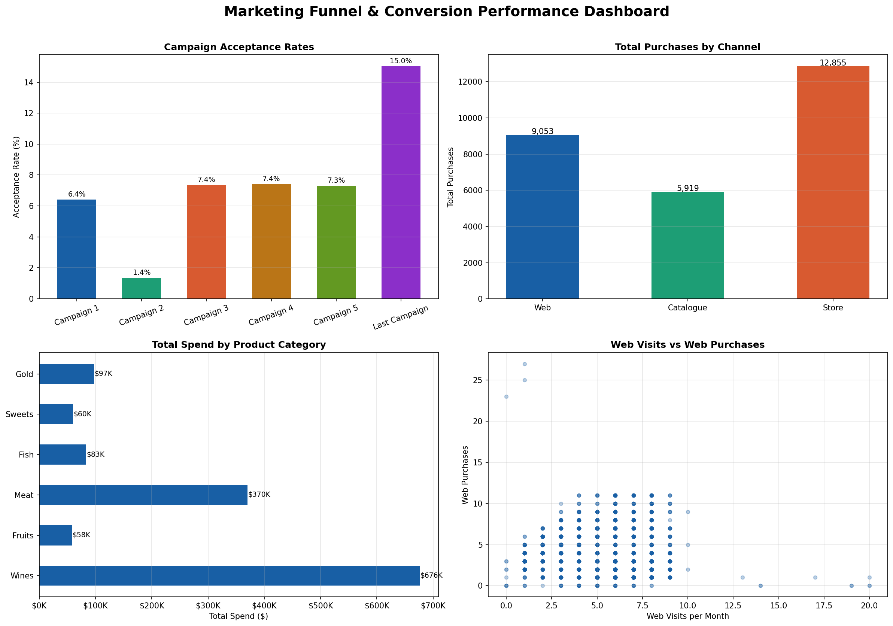

# Task 3 - Marketing Funnel & Conversion Performance Analysis
## Future Interns | Data Science & Analytics Track

## Overview
Analyzed real marketing campaign data from Kaggle to identify
campaign performance, channel conversions, and customer
spending patterns across multiple campaigns.

## Tools Used
- Python (Pandas, Matplotlib, NumPy)
- Google Colab
- GitHub for version control

## Dataset
- Source: Marketing Campaign Results (Kaggle)
- 2,240 real customer records
- Includes campaign responses, channel purchases and spend

## Key Insights
- Campaign acceptance rates vary significantly across campaigns
- Store purchases dominate all channels
- Wine is the top spending category by far
- Web visit-to-purchase conversion rate has significant room to grow

## Recommendations
1. Replicate best performing campaign strategy going forward
2. Invest more in top purchase channel to maximise conversions
3. Bundle top spending categories to increase order value
4. Improve web experience to convert more visitors into buyers

## Challenges Faced
- Dataset used tab separation instead of commas — solved
  with sep='\t' parameter in pandas read_csv
- Combined multiple spend columns into one TotalSpend feature
- Choosing the right chart type for each insight

## What I Learned
- How to engineer new features from raw campaign columns
- How to analyze multi-campaign performance side by side
- How to use scatter plots to explore visit-to-purchase patterns
- How to identify strongest performing marketing channels

## Files
- Task3_Marketing_Funnel_V2.ipynb — Full analysis notebook
- funnel_dashboard_v2.png — Professional 4-chart dashboard

